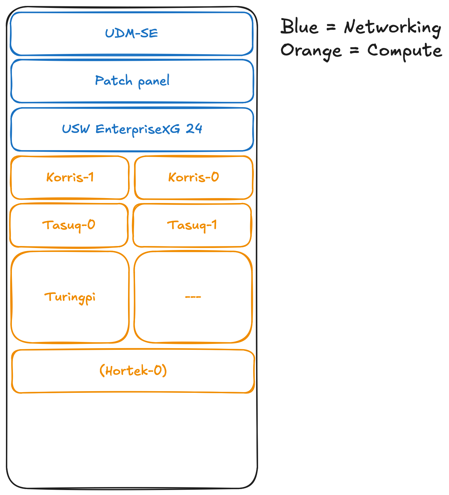

# Homelab

<!-- TOC -->
* [homelab](#homelab)
  * [Kubeseal](#kubeseal)
    * [Restore key in new cluster](#restore-key-in-new-cluster)
  * [Remove old replica sets](#remove-old-replica-sets)
  * [Known issues](#known-issues)
  * [Hardware setup](#hardware-setup)
  * [Talos](#talos)
    * [Generate secrets](#generate-secrets)
    * [Create nodes](#create-nodes)
      * [Control plane](#control-plane)
      * [Worker](#worker)
    * [Upgrade nodes](#upgrade-nodes)
<!-- TOC -->

## Kubeseal

```yaml
apiVersion: v1
kind: Secret
metadata:
  name: database-credentials
  namespace: default
type: Opaque
stringData:
  username: "admin"
  password: "p4ssw0rd"
```

To create a new encrypted secret run the following command:

```shell
kubeseal --controller-namespace sealed-secrets -o yaml <INPUT.yaml >OUTPUT.yaml
```

To encrypt a single value run the following command:

```shell
echo -n <VALUE> | kubeseal --controller-namespace sealed-secrets --raw --namespace <NAMESPACE> --name <NAME>
```

### Restore key in new cluster

```shell
kubectl get secrets -n sealed-secrets -o yaml > out.yaml
!! UPDATE KEY AND CRT !!
kubectl apply -f out.yaml
rm out.yaml
kubectl rollout restart -n sealed-secrets deployment sealed-secrets-controller
```

## Remove old replica sets

```shell
kubectl get replicaset -o jsonpath='{ .items[?(@.spec.replicas==0)]}' -A | k delete -f -
```

## Known issues

- https://longhorn.io/kb/troubleshooting-volume-with-multipath/

## Hardware setup


